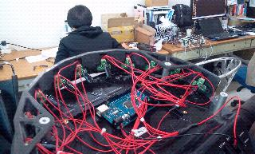

.. _chapter_advanced_usage:

Advanced Usage
==============

Replacing Batteries
-------------------
.. WARNING:: The electronics does not support the use of multiple battery packs at the same time!

.. |replace_battery_1| image:: _static/advanced_usage/replace_battery_1.jpg

+---------------------+---------------------+
| |replace_battery_1| | |replace_battery_2| |
+---------------------+---------------------+
| Flip the kobuki     | Open the cover      |
+---------------------+---------------------+
| |replace_battery_3| | |replace_battery_4| |
+---------------------+---------------------+
| Unplug              | Swap batteries      |
+---------------------+---------------------+
| |replace_battery_5| | |replace_battery_6| |
+---------------------+---------------------+
| Replug              | Replace the cover   |
+---------------------+---------------------+

Updating Firmware
-----------------
If you have a ROS installation, you can find the current version by running:
.. code-block:: bash

  $ rosrun kobuki_driver version_info
    # Version Info:
    * Hardware Version: 1.0.4
    * Firmware Version: 1.2.0`

Alternatively you can compile `version_info.cpp <https://github.com/yujinrobot/kobuki_core/blob/devel/kobuki_driver/src/tools/version_info.cpp>`_ (no ROS) to create your own version checker.

Linux
~~~~~

The Flashing Utility
********************
.. code-block:: bash

  # Download & build the flashing utility
  $ wget http://files.yujinrobot.com/kobuki/firmware/stm32flash-0.4.tar.gz
  $ tar -xvzf stm32flash.tar.gz
  $ cd stm32flash
  $ make

Download Firmware
*****************
.. code-block:: bash

  # choose the firmware version from http://files.yujinrobot.com/kobuki/firmware
  # e.g. latest
  $ wget http://files.yujinrobot.com/kobuki/firmware/kobuki_firmware-latest.hex

Identify ttyUSBx Port
*********************
If you have a udev rule installed, it will show up as `/dev/kobuki`, but if not, you can typically find it under one of the ttyUSB ports, e.g. /dev/ttyUSB0. 
If you are not sure, type `dmesg` into a terminal, unplug and replug the robot and type `dmesg` again. You should now be able to see which port is assigned to the robot (more precisely the FTDI USB to serial converter).

Switch to Download Mode
***********************
#. Connect the robot to your PC using the USB cable
#. Turn off the robot (switch on the side)
#. Switch from normal runtime mode to firmware download mode

This simply changes the type of data that is sent back and forth along the usb connection. You can do this by moving the switch illustrated below into the ‘download’ (up) position. Note that this switch is embedded into the robot cover so it isn’t easily thrown by accident – you may need thin plyers or some similar tool. You can find the mode switch mechanism on the right side of the control panel - see the image below.

Flashing
********
.. NOTE:: 
  The following instructions assume flashing of kobuki_firmware-latest.hex and port /dev/ttyUSB0. 
  Modify these if necessary.

.. WARNING:: you need to execute the flashing command IMMEDIATELY after turning the robot on!

#. Turn off the robot
#. Check that the switch is in download mode
#. Turn on the robot

.. code-block:: bash

  $ ./stm32flash -b 115200 -w kobuki_firmware_firmware-latest.hex /dev/ttyUSB0
    stm32flash 0.4

    http://stm32flash.googlecode.com/

    Using Parser : Intel HEX
    Interface serial_posix: 115200 8E1
    Version      : 0x22
    Option 1     : 0x00
    Option 2     : 0x00
    Device ID    : 0x0414 (High-density)
    - RAM        : 64KiB  (512b reserved by bootloader)
    - Flash      : 512KiB (sector size: 2x2048)
    - Option RAM : 16b
    - System RAM : 2KiB
    Write to memory
    Erasing memory
    Wrote address 0x0800a3f0 (100.00%) Done.

Rebooting
*********
- Turn off the robot power
- Flick the firmware switch back to ‘Operation’ mode.
- Turn on the robot power
- I’m happy, you should be too!

Windows
~~~~~~~

The Flashing Utility
********************
- Download and install the `windows flashing utility <http://files.yujinrobot.com/robot/kobuki/Flash_Loader_Demonstrator_v2.5.0_Setup.exe>`_

Download Firmware
*****************
Find and download the version of the firmware you wish to flash from the `Kobuki FW File Server <http://files.yujinrobot.com/kobuki/firmware>`_.

Identify the COM Port
*********************
Usually if this will show up on COM1, but check to make sure.

Switch to Download Mode
***********************
#. Connect the robot to your PC using the USB cable
#. Turn off the robot (switch on the side)
#. Switch from normal runtime mode to firmware download mode

This simply changes the type of data that is sent back and forth along the usb connection. You can do this by moving the switch illustrated below into the ‘download’ (up) position. Note that this switch is embedded into the robot cover so it isn’t easily thrown by accident – you may need thin plyers or some similar tool. You can find the mode switch mechanism on the right side of the control panel - see the image below.

Flashing
********
#. Turn off the robot
#. Check that the switch is in download mode
#. Turn on the robot

+------------------------------------------+-------------------------------------+
| |flash1|                                 | |flash2|                            |
+------------------------------------------+-------------------------------------+
| Configure Properties                     | Check that the target is identified |
+------------------------------------------+-------------------------------------+
| |flash3|                                 | |flash4|                            |
+------------------------------------------+-------------------------------------+
| Enter the Download from file (your .hex) | Success!                            |
+------------------------------------------+-------------------------------------+

Rebooting
*********
- Turn off the robot power
- Flick the firmware switch back to ‘Operation’ mode.
- Turn on the robot power
- I’m happy, you should be too!

Serial Port Connectivity
------------------------
Many embedded boards do not have usb interfaces, or the embedded board doesn’t have the necessary ftdi32 serial->usb support. In these cases it is simpler to utilise the serial port on Kobuki’s expansion port to driving kobuki by serial interface instead of USB.

Pinouts
~~~~~~~
Pictured below are the pinouts of Kobuki’s expansion port, include the serial pins. The minimum number of required pins for serial communication is three; TX, RX, and GND. Additionally EX3.3 or EX5 can be used for powering external devices, such as line transceiver.

.. image:: _static/anatomy/serial_port.jpg

- RX/TX : Serial data (voltage level is 3.3V)
- EX3.3/EX5 : 3.3V/1A and 5V/1A power supply
- DI0~3 : 4 x Digital input 
- high: 3.3~5V, low: 0V
- DO0~3 : 4 x Digital output
- open-drain, pull-up resistor required
- AI0~3 : 4 x Analog input
- 12bit ADC: 0~4095, 0~3.3V
- GND : Ground
- EN : Used for detecting an external board 
- connect to external ground

Connections
~~~~~~~~~~~

RS-232 Interface
****************
The voltage level of serial port is 3.3V. To connect kobuki with the standard `RS-232 <http://en.wikipedia.org/wiki/RS-232>`_ serial port, you should use line transceiver in the middle to convert voltage level. `MAX232 <http://en.wikipedia.org/wiki/MAX232>`_ chip is typical solution for it. Below diagram show simplified typical example of connections between Kobuki and `SBC <http://en.wikipedia.org/wiki/Single-board_computer>`_ (your embedded board, laptop or pc). EX3.3 pin is used to powering line transceiver. It can be EV5 pin or external power sources from outside.

Logic Level Interface
*********************
To connect kobuki with serial port of `MCU <http://en.wikipedia.org/wiki/Microcontroller>`_ directly, below is the simplest connection diagram can be used. Serial pins of kobuki are 5V-tolerant. It accepts 3.3V and 5V voltage levels typically used by integrated circuit. Connection with power pin(EX3.3 or EX5) is optional, if you powering MCU with independent sources, such as battery, or wall adaptor.

Building an Application
~~~~~~~~~~~~~~~~~~~~~~~
If you’re using the ROS implementation, or building atop the kobuki c++ driver, simply re-configure the port string used for the application and everything should be ready to go.

If building an experimental driver from scratch (e.g. android driver), then you will need to implement the `Kobuki Protocol <http://yujinrobot.github.io/kobuki/enAppendixProtocolSpecification.html>`_ specification.

Adding a Custom Sensor Array
----------------------------
Kobuki usually gets equipped with a 3d sensor These typically have limitations as obstacle avoidance sensor:

- Narrow fov (58° x 43° horizontal x vertical)
- Death zone on the first 45 cm
- Cannot detect glass walls
- Cannot detect polished metallic surfaces

In one experiment an 11 IR sensors half ring, pointing 12 degrees downward was added to compensate.

- Sensor model: Sharp GP2Y0A21YK
- Power supply: Kobuki’s 5V, 1A
- Sensor reading: Arduino MEGA 2560
- PC interface: Arduino custom firmware – Bosch adc_driver
- Mounting: 3D printed frame.

The analog output of sensors is read by the Arduino board, while for power and ground they are connected to Kobuki’s 5V 1A power source. Connecting several sensors to the same power supply makes readings very noisy when there aren’t obstacles. The solution was to put decoupling capacitors on each sensor. For interfacing Arduino, we use Bosch adc_driver. A funny problem comes sometimes when looking at corners in a particular angle (~30 degrees) : sensors get a spurious reading, no idea why. We just went on with this, as is not a common problem.
Different mounting frames are available for downloading and printing in our `file server <http://files.yujinrobot.com/kobuki/hardware/resources/>`_:

- Horizontally mounted MaxBotix’s LV-Maxsonars
- Horizontally mounted Sharp IR sensors
- 12 degrees downward pointing Sharp IR sensors

And the result:

