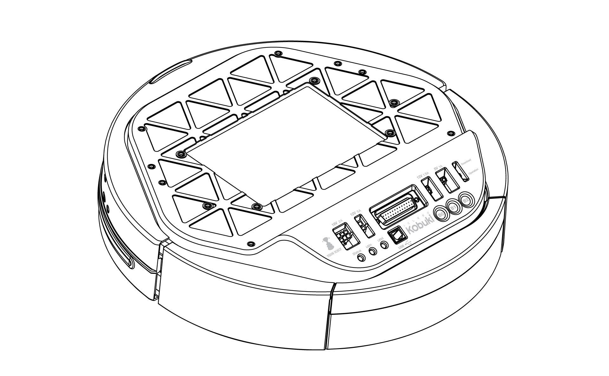
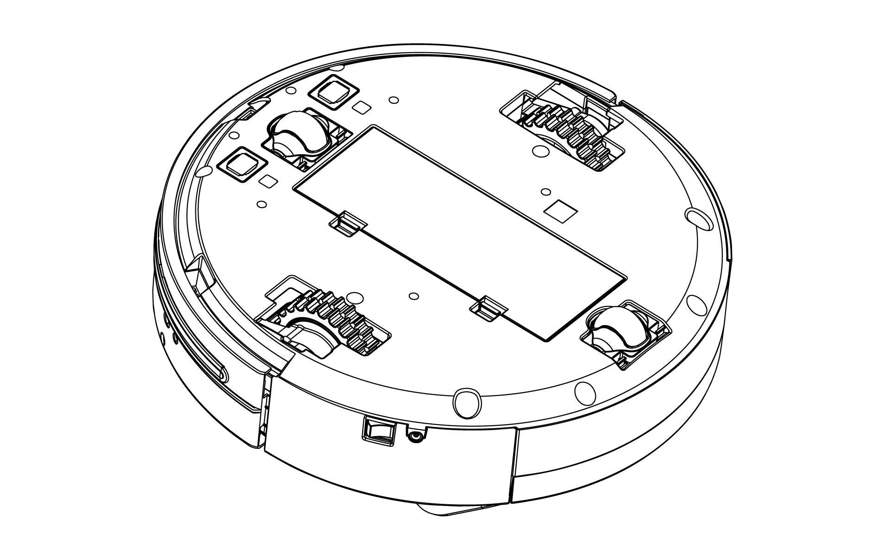
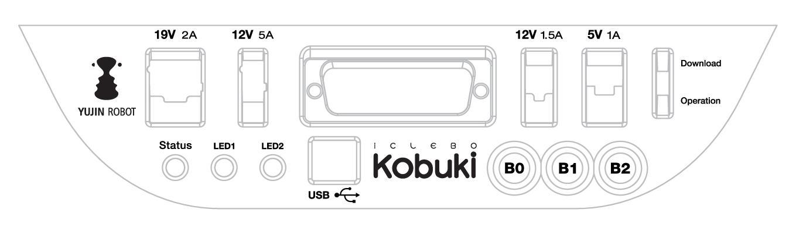
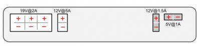
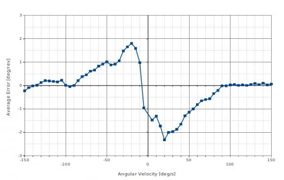
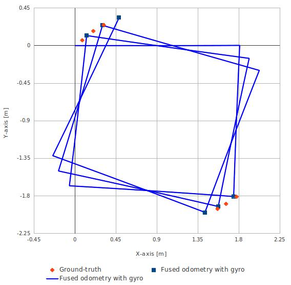
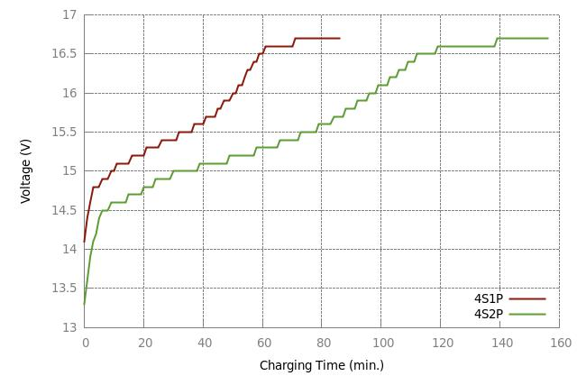
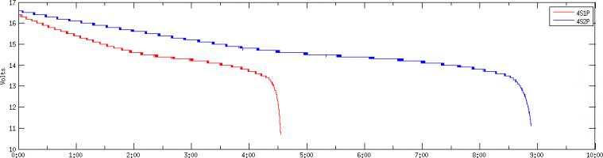
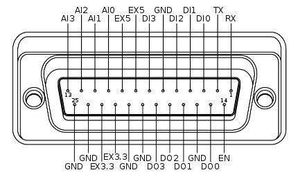

.. _chapter_anatomy:

Anatomy
=======

Top View
--------

Bottom View
-----------

Control Panel
-------------

- 19V/2A: Laptop power supply
- 12V/5A: Arm power supply
- 12v/1.5A: Microsoft Kinect power supply
- 5V/1A: General power supply
- Status LED: Indicates Kobuki’s status
- Green: Kobuki is turned on and battery at high voltage level
- Orange: On - Low battery voltage level (please charge soon)
- Green blinking: On - Battery charging
- Off: Kobuki is turned off.
- LED1/2: Programmable LEDs
- USB: Data connection
- BO/1/2: Buttons
- Firmware switch: Enable/disables the firmware update mode

Connectors
----------
.. NOTE:: 
    
    SOME NOTES ABOUT THE MOLEX PAGES BELOW

    1. We do not actually use Molex connectors but we are supplied by a Korean vendor who produces connectors according to the Molex standard. These links will be more useful to internationals in helping them find a mating part that works for them.
    2. The images on each page are representative of the series of connectors. Each series usually has a variety of connectors with a different number of pins. As a result, the pictures on some of the pages below may seem as though they have the incorrect number of pins, but do not worry about this – they are the correct links. Note that you can jump to different connectors in the series via the second part of their identification number (e.g. 43045-0224 for the 2-pin, 43045-0424 for the 4-pin).
    3. If some linked connectors are listed as obsolete on the molex website, don’t worry. The connector you are exactly requiring are those you can find under the ‘Mates with Parts’ link on each page. If these however should become obsolete as well, please let us know via email.

Power
~~~~~

- 5V@1A Molex PN : 43650-0218 – for custom boards
- 12V@1.5A : Molex PN : 43045-0224 – specially supporting the kinect
- 12V@5A : Molex PN : 3929-9023 – for high powered accessories (e.g. robotic arm)
- 19V@2A : Molex PN : 3928-9068 – for recharging netbooks

Battery
~~~~~~~
- `4S1P/4S2P Battery Pack Connector <http://www.molex.com/molex/products/datasheet.jsp?part=active/0039012040_CRIMP_HOUSINGS.xml>`_

I/O Port
~~~~~~~~
DB25 pin D-SUB Female connector that provides the following functionality (`pdf <http://2wge6q1kef543qsvqn11o3e8.wpengine.netdna-cdn.com/wp-content/uploads/2015/12/io_port_121024.pdf>`_)

Cables
~~~~~~
.. NOTE:: If you click on the preceding links for the power connectors, under the heading ‘Mates with Part(s)’ you can find the compatible connector to use with each power source. The most important one being of course:

- 12V@1.5A : `Molex PN : 43025-0200 <http://www.molex.com/molex/products/datasheet.jsp?part=active/0430250200_CRIMP_HOUSINGS.xml>`_ – specially supporting the kinect

Models & Drawings
-----------------
The models and drawings include both the base and parts for the Turtlebot 2.

- `2D mechanical drawings <http://files.yujinrobot.com/kobuki/hardware/drawings/>`_ – DWG, PDF
- `3D models <http://files.yujinrobot.com/kobuki/hardware/models/>`_ – IGS, STEP

The inserts in the kobuki plate are M4 threads (metric, 4mm). If you wish to build standoffs compatible for these inserts, please reference the pole pdf’s in the 2D mechanical drawings which are what we use for turtlebots.

Motors
------

Specifications
~~~~~~~~~~~~~~
- Brushed DC Motor
- Motor Manufacturer: Standard Motor
- Part Name: RP385-ST-2060
- Rated Voltage: 12 V
- Rated Load: 5 mN·m
- No Load Current: 210 mA
- No Load Speed: 9960 rpm ± 15%
- Rated Load Current: 750 mA
- Rated Load Speed: 8800 rpm ± 15%
- Armature Resistance: 1.5506 Ω at 25°C
- Armature Inductance: 1.51 mH
- Torque Constant(Kt): 10.913 mN·m/A
- Velocity Constant(Kv): 830 rpm/V
- Stall Current: 6.1 A
- Stall Torque: 33 mN·m

Control Method
~~~~~~~~~~~~~~
- Driven by voltage source(H-bridge)
- Controlled by Pulse-width modulation(PWM)

Gyro
----

Specification
~~~~~~~~~~~~~
- 3-Axis Digital Gyroscope
- Manufacturer : STMicroelectronics
- Part Name : L3G4200D
- Measurement Range: ±250 deg/s
- Yaw axis is factory calibrated within the range of ±20 deg/s to ±100 deg/s

Performance
~~~~~~~~~~~

In-Place Rotation Test
**********************
This graph shows the average heading error per revolution of gyro, when robot rotates with a given velocity.

Square Path Test
****************
This graph shows the position error of fused odometry with gyro, when robot moves along a square path. Robot moved with 0.1 m/s on the line segment and rotated with 30 deg/s on the corner.

This table shows the calculated angular error, when robot arrived at the diagonally opposite corner from the starting point (0.0, 0.0).

+--------------------------------+---------------------+
| Number of turns of square path | Angular Error [deg] |
+================================+=====================+
| 0.5                            | 0.47                |
+--------------------------------+---------------------+
| 1.5                            | 1.99                |
+--------------------------------+---------------------+
| 2.5                            | 3.18                |
+--------------------------------+---------------------+

Power Adapter
-------------
.. |powerphoto| replace:: ``powerphoto`` Photo
.. _powerphoto: http://2wge6q1kef543qsvqn11o3e8.wpengine.netdna-cdn.com/wp-content/uploads/2015/12/power_adapter.jpg
.. |spec1| replace:: ``spec1`` Specification 1 
.. _spec1: <http://2wge6q1kef543qsvqn11o3e8.wpengine.netdna-cdn.com/wp-content/uploads/2015/07/Kobuki-Adaptor.jpg>`_
.. |spec2| replace:: ``spec2`` Specification 2 
.. _spec2: <http://files.yujinrobot.com/kobuki/hardware/specifications/charger_spec.pdf>

+--------------------+---------------+--------------+
| Input              | Output        | Other        |
+====================+===============+==============+
| Voltage: 100-240V  | Voltage: 19V  | |powerphoto| |
+--------------------+---------------+--------------+
| Frequency: 50/60Hz | Ampere: 3.16A | |spec1|      |
+--------------------+---------------+--------------+
| Ampere: 1.5A Max   |               | |spec2|      |
+--------------------+---------------+--------------+

Batteries
---------
Kobuki by the default ships with a small Lithium-Ion battery pack (4S1P, 2200mAh, 14.8V). 

.. NOTE:: For extra long operation, a big battery pack (4S2P, 4400mAh, 14,8V) can be ordered as well. 

.. WARNING:: The electronics does not support the use of multiple battery packs at the same time (even if there is room in the battery compartment)

Specifications
~~~~~~~~~~~~~~
- `Data Sheet (pdf) <http://2wge6q1kef543qsvqn11o3e8.wpengine.netdna-cdn.com/wp-content/uploads/2015/12/kobuki_battery_4S1P.pdf>`_

Pinouts
~~~~~~~
- :red:`Red`: battery (+), 9.6 V ~ 16.8 V
- :grey:`White`: NTC thermistor to ground, 10 kΩ ± 1%
- Black: battery(-), Ground

Charing Profile
~~~~~~~~~~~~~~~
This plot shows the voltages as measured by the robot’s hardware. Both the standard 4S1P and the extra 4S2P batteries are compared. During the test, the robot was charging via adaptor.

Discharging Profile
~~~~~~~~~~~~~~~~~~~
This plot shows the voltage as measured by the robot’s hardware. Both the standard 4S1P and the extra 4S2P batteries are compared. During the test, the robot was continuously spinning, with the Kinect camera running.

Serial Port
-----------

- RX / TX: Serial data connection (RS232; used voltage level is 3.3V!)
- EX3.3 / EX5: 3.3V/1A and 5V/1A power supply
- DI0 - 3: 4 x Digital input (high: 3.3 - 5V, low: 0V)
- DO0 - 3: 4 x Digital output  (open-drain, pull-up resistor required)
- AI0-3: 4 x Analog input (12bit ADC: 0 - 4095, 0 - 3.3V)
- GND: Ground
- EN: Used for detecting an external board (connect to external ground)

