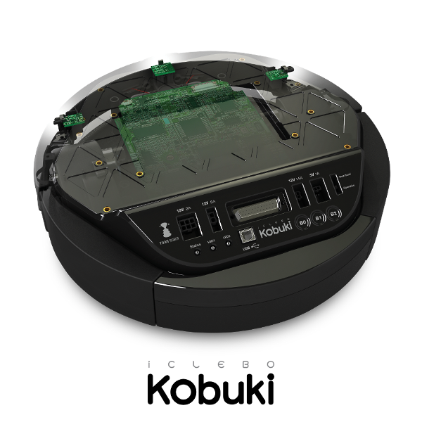

.. kobuki documentation master file, created by
   sphinx-quickstart on Mon Jul 10 19:43:17 2017.
   You can adapt this file completely to your liking, but it should at least
   contain the root `toctree` directive.

Welcome to Yujin Kobuki's documentation!
========================================

.. include:: contents.rst

This documentation is copied from the Kobuki User Guide provided by Yujin, and formatted into a reStructuredText document using Sphinx.

Except where otherwise noted, these design documents are licensed under `Creative Commons Attribution 4.0 International License`_.

.. _Creative Commons Attribution 4.0 International License: http://creativecommons.org/licenses/by/4.0/
